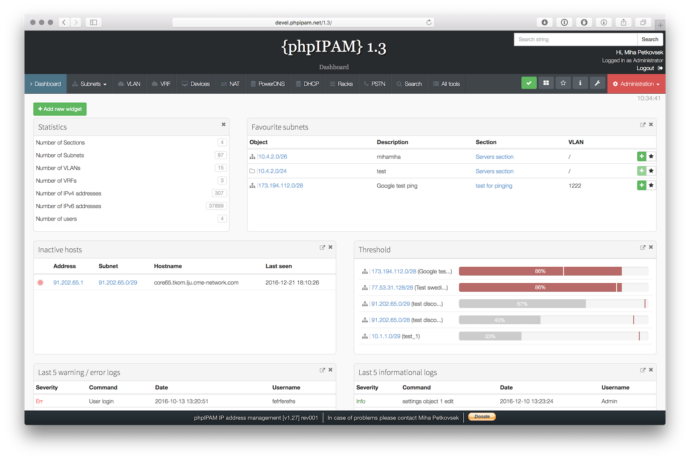

<!--
Este archivo README esta generado automaticamente<https://github.com/YunoHost/apps/tree/master/tools/readme_generator>
No se debe editar a mano.
-->

# phpIPAM para Yunohost

[](https://ci-apps.yunohost.org/ci/apps/phpipam/)  

[](https://install-app.yunohost.org/?app=phpipam)

*[Leer este README en otros idiomas.](./ALL_README.md)*

> *Este paquete le permite instalarphpIPAM rapidamente y simplement en un servidor YunoHost.*  
> *Si no tiene YunoHost, visita [the guide](https://yunohost.org/install) para aprender como instalarla.*

## Descripción general

phpIPAM is an open-source web IP address management application. Its goal is to provide light and simple IP address management application. It is ajax-based using jQuery libraries, it uses php scripts and javascript and some HTML5/CSS3 features, so some modern browser is preferred to be able to display javascript quickly and correctly.

**Versión actual:** 1.19.008~ynh1

**Demo:** <http://demo.phpipam.net>

## Capturas



## Documentaciones y recursos

- Sitio web oficial: <https://phpipam.net>
- Documentación administrador oficial: <https://phpipam.net/documents/>
- Repositorio del código fuente oficial de la aplicación : <https://github.com/phpipam/phpipam>
- Catálogo YunoHost: <https://apps.yunohost.org/app/phpipam>
- Reportar un error: <https://github.com/YunoHost-Apps/phpipam_ynh/issues>

## Información para desarrolladores

Por favor enviar sus correcciones a la [rama `testing`](https://github.com/YunoHost-Apps/phpipam_ynh/tree/testing).

Para probar la rama `testing`, sigue asÍ:

```bash
sudo yunohost app install https://github.com/YunoHost-Apps/phpipam_ynh/tree/testing --debug
o
sudo yunohost app upgrade phpipam -u https://github.com/YunoHost-Apps/phpipam_ynh/tree/testing --debug
```

**Mas informaciones sobre el empaquetado de aplicaciones:** <https://yunohost.org/packaging_apps>
