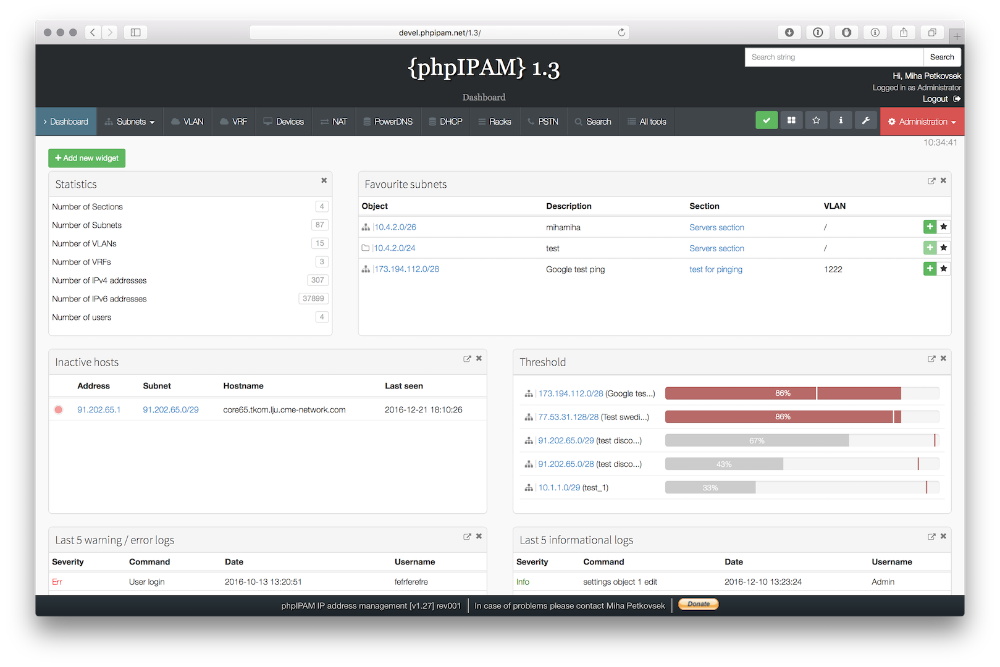

<!--
NB: Deze README is automatisch gegenereerd door <https://github.com/YunoHost/apps/tree/master/tools/readme_generator>
Hij mag NIET handmatig aangepast worden.
-->

# phpIPAM voor Yunohost

[](https://ci-apps.yunohost.org/ci/apps/phpipam/)  

[](https://install-app.yunohost.org/?app=phpipam)

*[Deze README in een andere taal lezen.](./ALL_README.md)*

> *Met dit pakket kun je phpIPAM snel en eenvoudig op een YunoHost-server installeren.*  
> *Als je nog geen YunoHost hebt, lees dan [de installatiehandleiding](https://yunohost.org/install), om te zien hoe je 'm installeert.*

## Overzicht

phpIPAM is an open-source web IP address management application. Its goal is to provide light and simple IP address management application. It is ajax-based using jQuery libraries, it uses php scripts and javascript and some HTML5/CSS3 features, so some modern browser is preferred to be able to display javascript quickly and correctly.

**Geleverde versie:** 1.7.0~ynh1

**Demo:** <http://demo.phpipam.net>

## Schermafdrukken



## Documentatie en bronnen

- Officiele website van de app: <https://phpipam.net>
- Officiele beheerdersdocumentatie: <https://phpipam.net/documents/>
- Upstream app codedepot: <https://github.com/phpipam/phpipam>
- YunoHost-store: <https://apps.yunohost.org/app/phpipam>
- Meld een bug: <https://github.com/YunoHost-Apps/phpipam_ynh/issues>

## Ontwikkelaarsinformatie

Stuur je pull request alsjeblieft naar de [`testing`-branch](https://github.com/YunoHost-Apps/phpipam_ynh/tree/testing).

Om de `testing`-branch uit te proberen, ga als volgt te werk:

```bash
sudo yunohost app install https://github.com/YunoHost-Apps/phpipam_ynh/tree/testing --debug
of
sudo yunohost app upgrade phpipam -u https://github.com/YunoHost-Apps/phpipam_ynh/tree/testing --debug
```

**Verdere informatie over app-packaging:** <https://yunohost.org/packaging_apps>
